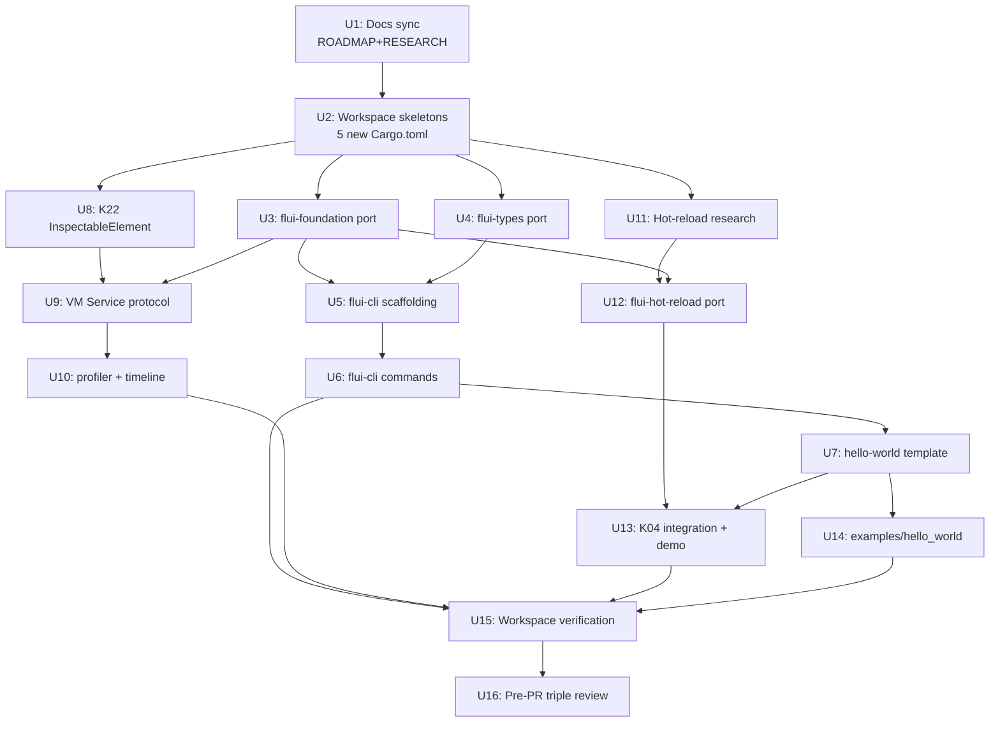

# feat: Track 2 egui-easy — v1 port

> **v1 source repo:** `C:\Users\vanya\RustroverProjects\flui\crates\` (read-only reference, not a v2 path). v2 paths below use repo-relative form.

## Summary

Port subset из v1 в v2 — 5 крейтов реализуют track 2 "DX & low-ceremony onboarding" из `STRATEGY.md`. Phased delivery: docs sync first (`ROADMAP.md` + `RESEARCH.md` currently mark эти крейты "Out of scope" / Phase IV), затем foundation/types (parallel mechanical port), CLI (subset 10+ runtime-agnostic команд), DevTools substrate (включает minimal K22 `InspectableElement` trait), hot-reload последним (highest risk, re-arch над gpui-ce primitives через K04 `defer_to(NextFrameStart, ...)` pattern + `abort_frame_after_panic`). Approach prefers minimum-surface-change для public API (`#[non_exhaustive]` enums везде в protocol, `smol::process::Command` everywhere в CLI).

---

## Problem Frame

См. origin doc — v1 имел реальный код под "Flutter dev experience", abandoned mid-development после RenderObject pipeline break. v2 hard-fork`gpui-ce` обошёл render wall, но пустой по DX-tooling. Этот план — execution path для перетаскивания DX-tooling из v1 в v2 workspace.

---

## Requirements

R1-R23 carried verbatim из origin. Полный список → `docs/brainstorms/2026-05-19-track-2-egui-easy-v1-port-requirements.md`. Trace ниже + per-unit requirements citation.

**Origin actors:** A1 (Primary user — Rust dev), A2 (Maintainer), A3 (Future contributor).
**Origin acceptance examples:** AE1 (covers R1, R3), AE2 (covers R4), AE3 (covers R15), AE4 (covers R19).

---

## Scope Boundaries

- Остальные 16 v1 крейтов (`flui-animation`, `flui-app`, `flui-assets`, `flui-build`, `flui-engine`, `flui-interaction`, `flui-layer`, `flui-log`, `flui-painting`, `flui-platform`, `flui-reactivity`, `flui-rendering`, `flui-scheduler`, `flui-semantics`, `flui-tree`, `flui-view`) — runtime-уровень, replaced by gpui-ce; NOT in scope.
- Phase III mobile/web/iOS/Android/wasm targets — CLI `devices`/`emulators`/`platform`/mobile branches в `build`/`run`; build/devtools mobile-specific paths.
- DevTools UI app (frontend) — deferred к Tier C ecosystem; flui-devtools здесь = headless protocol substrate only.
- flui-build crate port — DROPPED. CLI's `build`/`analyze`/`upgrade` shell out к cargo напрямую через local `runner` module ported из v1.
- Templates beyond hello-world (admin-shape, material-shape, etc) — заблокированы Tier C widget library, которой ещё нет.
- flui-foundation/flui-types fold в flui-core — deferred к будущему K-track audit. Now: parallel-impl.
- v1 `flui-log` crate — NOT портируется (use workspace `tracing`).
- v1 RenderObject-dependent code — discard or rewrite, не carry forward.

### Deferred to Follow-Up Work

- DevTools UI frontend (web app или native viewer) — separate PR / Tier C track.
- Hot-reload mechanism final selection if research unit reveals greenfield need (`subsecond` integration, custom dynlib refresh) — could spawn separate PR if scope inflates.
- flui-foundation/flui-types `flui-core` fold pass — separate future K-track spec.
- Admin/material/dashboard template crates — separate PR after widget library lands.

---

## Context & Research

### Relevant Code and Patterns

- `tooling/lock-checks/Cargo.toml` — workspace-member CLI precedent с `[[bin]]` declaration.
- `crates/flui-framework/Cargo.toml` — v2 Cargo.toml shape (workspace-inherited identity, `[lints] workspace = true`, path-deps).
- `crates/flui-navigator/Cargo.toml:20` — opt-in feature convention (`default = ["log", ...]`, optional deps via `dep:crate`).
- `crates/flui-core/src/frame/{mod.rs,profile.rs,clock.rs,tick.rs}` — K04 substrate (FramePhase, FrameProfile, FrameClock).
- `crates/flui-core/src/inspector.rs` — gpui-ce inspector remnant (NOT K22; K22 substrate must be created).
- `crates/flui-core/src/element/identity.rs` — v2 K02 Key types (collision-aware port for foundation).
- `crates/flui-core/src/geometry.rs` + `color.rs` — v2 base types (overlap audit for flui-types).
- `examples/nav_demo/src/main.rs` + `examples/widget_surface_demo/src/main.rs` — boilerplate для new examples crate.
- `clippy.toml:17-22` — `disallowed-methods` enforcing `smol::process::Command` over `std::process::Command`.
- v1 `<v1-root>/crates/flui-cli/{main.rs, commands/, runner.rs, error.rs, types.rs, templates/}` — port source.
- v1 `<v1-root>/crates/flui-foundation/src/{assert.rs, binding.rs, callbacks.rs, debug.rs, error.rs, id.rs, key.rs, notifier.rs, observer.rs}` — port source.
- v1 `<v1-root>/crates/flui-types/src/{geometry/*, styling/*}` — port source (net-new only).
- v1 `<v1-root>/crates/flui-hot-reload/src/{lib.rs, dynlib.rs, driver.rs, host.rs, pipeline.rs, plugin.rs}` — port source (re-arch over gpui-ce).
- v1 `<v1-root>/crates/flui-devtools/src/{lib.rs, common.rs, profiler.rs, timeline.rs, hot_reload.rs}` — port source (only `common/profiler/timeline/hot_reload` impl'd; `memory.rs`/`network.rs`/`remote.rs` are stubs — replace with VM Service protocol layer).

### Institutional Learnings

- **MSRV 1.95 triangle**: `Cargo.toml`, `rust-toolchain.toml`, `clippy.toml` must stay synced. Prefer modern idioms (AFIT/RPITIT/let-chains/OnceLock/LazyLock/`#[diagnostic::on_unimplemented]`).
- **K04 hot-reload hooks**: `FramePhase::HotReload` reserved variant (not impl'd), `App::abort_frame_after_panic` is `pub(crate)` (NOT public — verified at `crates/flui-core/src/app.rs:2514`). External hot-reload crates cannot call it directly; they rely on App's internal panic recovery firing automatically when a `defer_to` callback panics. `FrameProfile` always-on telemetry is the public surface.
- **K22 substrate gap**: `InspectableElement` trait absent — must ship minimal version inside this port to unblock devtools cleanly (vs polling-only fallback).
- **Cargo.lock policy FREEZE** per K99 — don't `cargo update` opportunistically.
- **Pre-PR triple review mandatory** per user memory `feedback_pre_pr_review_agents.md`: `flui-arch-reviewer` + `migration-risk-adversary` + `rust-api-migration-auditor` in parallel.
- **Docs-vs-code separation** per user memory `feedback_docs_vs_code.md`: doc updates (`ROADMAP.md`, `RESEARCH.md`) land in separate PR ahead of implementation.
- **`smol::process::Command` mandatory** for v1 CLI port — every `std::process::Command::{spawn,output,status,...}` rewrite required.
- **`pollster` → `smol::block_on`** for sync entry в CLI (workspace runtime alignment).

### External References

- v1 hot-reload mechanism research → deferred to U11 plan unit (Rust ecosystem state: `subsecond`, `hot-lib-reloader`, custom dynlib in 2026).
- Flutter DevTools VM Service protocol spec → consumed during U9 implementation.

---

## Key Technical Decisions

- **5 separate crates, не consolidated mega-crate**: Preserves modularity per origin Key Decisions.
- **foundation/types parallel-impl, не fold в flui-core**: Per origin Key Decisions.
- **DevTools wire protocol = Flutter VM Service**: Most stable + widest tool support (synthesis call-out, user-confirmed default).
- **Hot-reload K04 integration via `App::defer_to(NextFrameStart, ...)`**: Minimum surface change; avoids freezing `FramePhase::HotReload` variant contract prematurely. `abort_frame_after_panic` is `pub(crate)` — flui-hot-reload does NOT call it directly. K04's existing internal path catches `defer_to` callback panics automatically; flui-hot-reload's job is only to ensure plugin work happens inside a `defer_to` callback so panic recovery applies (synthesis call-out, user-confirmed default).
- **Minimal K22 `InspectableElement` trait shipped inside this port**: Unblocks devtools cleanly без separate K22 spec dependency (synthesis call-out, user-confirmed default).
- **Doc consistency upfront**: `ROADMAP.md`/`RESEARCH.md` updates land before implementation (synthesis call-out, user-confirmed default).
- **`smol::process::Command` everywhere в CLI**: Workspace clippy enforces; v1 `std::process::Command` requires mechanical rewrite.
- **`pollster` → `smol::block_on`**: Workspace runtime alignment.
- **`flui-log` → `tracing` (per-crate choice, NOT workspace standard)**: Per origin R22. Note: v2 has no workspace logging standard — `flui-core` uses `log`, `flui-navigator` uses `tracing`. ROADMAP A4 (Tracing standardization) is OPEN. flui-cli ports to `tracing-subscriber` standalone; future A4 spec may unify.
- **No new `pub` symbols в mechanical port**: Tighten visibility — v1 had loose `pub` usage; ports default to `pub(crate)` / `pub(super)` / private.
- **`#[non_exhaustive]` on all new protocol/wire-format enums from day one**: K04 lesson — `FramePhase::COUNT pub const` semver hazard was caught only at review.

---

## Open Questions

### Resolved During Planning

- DevTools protocol version: VM Service (synthesis call-out resolved).
- K22 substrate timing: ship minimal inside this port (synthesis call-out resolved).
- Hot-reload K04 integration shape: `defer_to(NextFrameStart, ...)` pattern (synthesis call-out resolved).
- Doc sync sequencing: doc-only changes ahead of implementation (synthesis call-out resolved).

### Deferred to Implementation

- Hot-reload Rust ecosystem mechanism selection (`subsecond` vs `hot-lib-reloader` vs custom dynlib port-as-is) — resolved via U11 research unit producing decision doc.
- v1 `flui-foundation` per-module compile audit on Rust 1.95 — discovered during U3 port.
- v1 `flui-types` overlap-collision specifics (which v2 `geometry`/`color` types alias vs co-exist) — discovered during U4 port.
- Naming for v1 `flui-foundation::key::Key` vs v2 `flui-core::element::identity::Key` collision — discovered during U3 port (likely rename foundation's to `FoundationKey` or scope to `foundation::key::Key`).
- v1 `flui-devtools::FramePhase` (3 variants) reconciliation with v2 `flui-core::frame::FramePhase` (8 variants) — discovered during U10 port (likely rename devtools' to `DevToolsFramePhase` or drop in favor of v2's enum).
- Exact subset of v1 `flui-cli` commands compiling cleanly без `flui-build` — discovered during U5/U6 port.

### From 2026-05-19 review

- **U15 numbered-unit vs fold-into-per-unit-verification** — scope-guardian reviewer recommended folding U15's checklist into U2/U3/U4/U5-U7/U9-U13 verification sections (rationale: U15 has no net-new files, CI already covers stated work). Counter-argument: keeping U15 as an explicit unit preserves visibility of the cross-platform verification gate. Genuine judgment call — decide before `/ce-work` starts.

---

## Output Structure

```
crates/
├── flui-cli/                     # NEW
│   ├── Cargo.toml
│   ├── src/
│   │   ├── main.rs               # clap entry + Cli/Subcommand structs
│   │   ├── commands/
│   │   │   ├── mod.rs
│   │   │   ├── create.rs
│   │   │   ├── create_interactive.rs
│   │   │   ├── run.rs
│   │   │   ├── build.rs
│   │   │   ├── test.rs
│   │   │   ├── clean.rs
│   │   │   ├── doctor.rs
│   │   │   ├── completions.rs
│   │   │   ├── format.rs
│   │   │   ├── analyze.rs
│   │   │   └── upgrade.rs
│   │   ├── runner.rs             # smol::process::Command builders
│   │   ├── error.rs              # CliError, CliResult
│   │   ├── types.rs              # ProjectName, ProjectPath, OrganizationId newtypes
│   │   ├── config.rs             # flui.toml handling
│   │   ├── templates/
│   │   │   ├── mod.rs
│   │   │   └── hello_world.rs    # only template in v1 scope
│   │   ├── utils.rs
│   │   └── prelude.rs
│   └── tests/
│       └── integration_tests.rs
├── flui-foundation/              # NEW
│   ├── Cargo.toml
│   ├── src/
│   │   ├── lib.rs                # public surface + module declarations
│   │   ├── assert.rs
│   │   ├── binding.rs
│   │   ├── callbacks.rs
│   │   ├── consts.rs
│   │   ├── debug.rs
│   │   ├── error.rs
│   │   ├── id.rs
│   │   ├── key.rs                # scoped under foundation::key (collision-aware)
│   │   ├── notifier.rs
│   │   ├── observer.rs
│   │   └── prelude.rs
│   └── tests/
│       └── integration_tests.rs
├── flui-types/                   # NEW
│   ├── Cargo.toml
│   ├── src/
│   │   ├── lib.rs
│   │   ├── geometry/
│   │   │   ├── mod.rs
│   │   │   ├── bezier.rs
│   │   │   ├── circle.rs
│   │   │   ├── line.rs
│   │   │   ├── matrix4.rs
│   │   │   ├── offset.rs
│   │   │   ├── rect.rs           # distinct from gpui-ce Bounds
│   │   │   ├── rrect.rs
│   │   │   ├── transform.rs
│   │   │   ├── transform2d.rs
│   │   │   ├── vector.rs
│   │   │   └── rsuperellipse.rs
│   │   ├── styling/
│   │   │   ├── mod.rs
│   │   │   ├── border.rs
│   │   │   ├── border_radius.rs
│   │   │   ├── color32.rs        # 4-byte RGBA8; v2's Rgba is 16-byte
│   │   │   ├── decoration.rs
│   │   │   ├── gradient.rs
│   │   │   └── shadow.rs
│   │   └── prelude.rs
│   └── tests/
│       └── integration_tests.rs
├── flui-hot-reload/              # NEW
│   ├── Cargo.toml
│   ├── src/
│   │   ├── lib.rs
│   │   ├── dynlib.rs             # libloading wrapper (cross-platform FFI)
│   │   ├── driver.rs             # mtime-poll loop + K04 defer_to integration
│   │   ├── host.rs               # plugin loader
│   │   ├── plugin.rs             # FFI export macros (re-arch'd over gpui-ce)
│   │   └── pipeline.rs           # gpui-ce-compatible reload pipeline
│   └── tests/
│       └── integration_tests.rs
├── flui-devtools/                # NEW
│   ├── Cargo.toml
│   ├── src/
│   │   ├── lib.rs
│   │   ├── common.rs             # DevToolsConfig + shared types
│   │   ├── profiler.rs           # subscribes to K04 FrameProfile
│   │   ├── timeline.rs           # Chrome DevTools trace JSON export
│   │   ├── protocol/             # VM Service protocol layer (replaces v1 stubs)
│   │   │   ├── mod.rs
│   │   │   ├── messages.rs       # #[non_exhaustive] enums
│   │   │   ├── server.rs         # smol::net TCP listener
│   │   │   └── handlers.rs
│   │   └── hot_reload.rs         # devtools↔hot-reload bridge (renamed if collision)
│   └── tests/
│       └── integration_tests.rs
└── flui-core/
    └── src/
        └── inspectable.rs        # NEW: K22 minimal InspectableElement trait

examples/
└── hello_world/                  # NEW: verifies flui create output works
    ├── Cargo.toml
    └── src/
        └── main.rs
```

---

## Implementation Units

### U1. Sync `ROADMAP.md` + `RESEARCH.md` with STRATEGY Track 2

**Goal:** Update project docs to reflect STRATEGY.md Track 2 promotion of flui-cli, flui-devtools, hot-reload from "Out of scope" / Phase IV to active work.

**Requirements:** Setup prerequisite for R1–R23 (institutional consistency).

**Dependencies:** None.

**Files:**
- Modify: `.ai-factory/ROADMAP.md` (line 188 "Out of scope" section + add 5 new entries; line ~89 K94 prelude may also be cross-referenced).
- Modify: `.ai-factory/RESEARCH.md` (line ~278, ~321 — supersede "hot-reload deferred to R-track").
- Modify: `STRATEGY.md` (verify Track 2 wording matches — likely no change needed).

**Approach:**
- **Split promotion by risk tier:** Replace "Out of scope" entries for flui-cli/flui-devtools/flui-foundation/flui-types (`ROADMAP.md:188`) with **"active Track 2"** linked to origin doc + this plan. flui-hot-reload promoted to **"active research, ship gated on U11 outcome"** — NOT full Track 2 commitment. This preserves escape valve if U11 research concludes no production-ready mechanism exists.
- Add explicit roadmap entries для каждого из 5 крейтов (status, link to plan).
- In `RESEARCH.md`, supersede the "hot-reload Phase IV / R-track" claim with a pointer к Track 2 promotion in STRATEGY.md — but qualify hot-reload's status as "active research, conditional commit".
- **Modify ROADMAP anti-goal #6** (`ROADMAP.md:252`): "❌ Do not re-introduce v1's multi-crate engine split (`flui-foundation` / `flui-engine` / `flui-rendering` / …). Engine stays single-crate (`flui-core`)." Anti-goal narrows to apply only to runtime/engine crates (`flui-engine`, `flui-rendering`, `flui-layer`, `flui-painting`, `flui-tree`, `flui-view`). DX-tier crates (`flui-foundation`, `flui-types`, `flui-cli`, `flui-devtools`, `flui-hot-reload`) are explicitly OUT of the anti-goal because they serve Track 2 DX commitment per STRATEGY.md. Document rationale: "Engine consolidation prevents v1's multi-crate engine split; DX-tier crates serve a different concern (developer ergonomics + tooling) and earn their separateness."

**Execution note:** Doc-only PR; lands ahead of implementation per docs-vs-code memory.

**Patterns to follow:** Existing roadmap entry format (see K-track entries для shape).

**Test scenarios:**
- Test expectation: none — doc-only updates, no behavioral change. Verification = manual review + no broken cross-references.

**Verification:**
- `grep -n "flui-cli\|flui-devtools\|hot-reload" .ai-factory/ROADMAP.md` returns active-status entries, not "Out of scope" markers.
- `grep -n "Phase IV\|R-track" .ai-factory/RESEARCH.md` related to hot-reload returns superseded markers or removed entries.
- `STRATEGY.md` Track 2 still names hot-reload, inspector, prelude expansion, etc.

---

### U2. Add 5 crate skeletons to workspace

**Goal:** Add `flui-cli`, `flui-foundation`, `flui-types`, `flui-hot-reload`, `flui-devtools` крейты в workspace as empty skeletons. Verify `cargo build --workspace` green.

**Requirements:** R21 (workspace members), R23 (v1 crate names preserved).

**Dependencies:** U1.

**Files:**
- Modify: `Cargo.toml` (root) — add 5 new members к `[workspace] members` list.
- Create: `crates/flui-cli/Cargo.toml`, `crates/flui-cli/src/main.rs` (`fn main() {}` placeholder).
- Create: `crates/flui-foundation/Cargo.toml`, `crates/flui-foundation/src/lib.rs` (`//! Stub`).
- Create: `crates/flui-types/Cargo.toml`, `crates/flui-types/src/lib.rs` (`//! Stub`).
- Create: `crates/flui-hot-reload/Cargo.toml`, `crates/flui-hot-reload/src/lib.rs` (`//! Stub`).
- Create: `crates/flui-devtools/Cargo.toml`, `crates/flui-devtools/src/lib.rs` (`//! Stub`).
- Create: `docs/research/v1-compile-status-audit.md` — **per-module compile-status table** for v1 crates being ported (`flui-foundation`, `flui-types`, `flui-cli`, `flui-hot-reload`, `flui-devtools`). For each module file: status = MECHANICAL (compiles + tests pass against Rust 1.95) / REPAIR (compiles with localized fixes) / REWRITE (depends on missing v1 substrate like `flui-engine`/`flui-rendering`). This audit MUST land before U3 starts; subsequent units' "mechanical port" framing depends on its findings. Output is informational — no source code changes.

**Approach:**
- Each `Cargo.toml` follows v2 idiomatic shape: `version = "0.1.0"` literal, identity fields `.workspace = true`, `[lints] workspace = true`. Description одна строка, keywords/categories реалистичные.
- `flui-cli` declares `[[bin]] name = "flui", path = "src/main.rs"` (mirror `tooling/lock-checks/Cargo.toml`).
- Initial deps empty (kept minimal — actual deps land per-unit).
- Skeletons compile-able: each `lib.rs`/`main.rs` is `//! Stub for U-X port` plus `pub fn _stub() {}` for libs или `fn main() {}` for bin.
- All 5 crates in single diff к root Cargo.toml.

**Execution note:** Skeleton-only; defer real implementation к later units.

**Patterns to follow:**
- `crates/flui-framework/Cargo.toml` для Cargo.toml shape.
- `tooling/lock-checks/Cargo.toml` для bin crate shape.
- ADR-016 wasm-target gating contract block (see `crates/flui-core/Cargo.toml:1-21`) — adopt comment style для будущих feature gates.

**Test scenarios:**
- Test expectation: none — scaffolding only; behavioural tests land с each crate's port.

**Verification:**
- `cargo build --workspace --all-features` green on Windows + Linux + Mac.
- `cargo check --workspace` green.
- `cargo clippy --workspace --all-targets` clean (no `disallowed_methods`, no `dbg_macro`, no `redundant_clone`).
- `cargo metadata --no-deps` shows all 5 new crates с `rust-version = "1.95"` inherited from workspace.

---

### U3. flui-foundation port — utility primitives

**Goal:** Port v1 `flui-foundation` modules (`assert`, `binding`, `callbacks`, `consts`, `debug`, `error`, `id`, `key`, `notifier`, `observer`) в v2 workspace. Mechanical port + collision-aware naming.

**Requirements:** R7, R8, R9, R22.

**Dependencies:** U2.

**Files:**
- Modify: `crates/flui-foundation/Cargo.toml` (add deps as version literals — workspace has NO `[workspace.dependencies]` block; deps are per-crate: `bitflags = "2"`, `dashmap = "6"`, `parking_lot = "0.12"`, `thiserror = "2"`, `tracing = "0.1"`).
- Create: `crates/flui-foundation/src/lib.rs` (public surface, module declarations).
- Create: `crates/flui-foundation/src/{assert,binding,callbacks,consts,debug,error,id,key,notifier,observer}.rs` (port из v1).
- Create: `crates/flui-foundation/src/prelude.rs` (curated re-exports).
- Create: `crates/flui-foundation/tests/integration_tests.rs`.

**Approach:**
- Mechanical port из v1 файлов; modernize только где Rust 1.95 idioms help (let-chains, `OnceLock`, `LazyLock` instead of `once_cell`).
- **Naming collision:** v1's `flui-foundation::key::Key` collides с v2's `flui-core::element::identity::Key`. Resolve в foundation by keeping name scoped (`flui_foundation::key::Key`) — downstream users disambiguate via qualified path. Document collision в module rustdoc.
- `consts` module port verifies `IS_DESKTOP` / `IS_MOBILE` / `IS_WEB` flags align с v2 build-targets.
- Drop `wasm` module если v1's content is platform-specific и v2 doesn't target wasm в Phase II.
- Drop `platform` module если duplicates `flui-core::platform`.
- Per-module rustdoc anchor: `//! Ported from flui v1 — see docs/brainstorms/2026-05-19-track-2-egui-easy-v1-port-requirements.md`.
- No new `pub` symbols beyond what v1 exposed; scope tighter where reasonable.
- `prelude` curated to core re-exports (Id types, Listenable, ChangeNotifier, callback shapes, common errors).

**Execution note:** Port each module file independently; verify compile after each.

**Technical design:** *(directional — not implementation specification)*

Module structure:
```
flui-foundation/
  ├── error.rs   → FluiError, FoundationError, Result
  ├── assert.rs  → debug-only assertions; depends on error
  ├── consts.rs  → EPSILON, IS_DESKTOP, etc.
  ├── id.rs      → Id<T: Marker>, marker types
  ├── key.rs     → Key, ValueKey, ViewKey (scoped, не collides with flui-core)
  ├── callbacks.rs → ValueChanged, ValueGetter, etc.
  ├── observer.rs  → ObserverList, etc.
  ├── notifier.rs  → ChangeNotifier, Listenable, ValueListenable, ValueNotifier
  ├── binding.rs   → BindingBase, HasInstance
  ├── debug.rs     → DiagnosticsBuilder, DiagnosticsNode (Flutter-shaped)
  └── lib.rs      → declares modules + re-exports public surface
```

**Patterns to follow:**
- v1 `flui-foundation/src/lib.rs:162-239` re-export list.
- v2 `crates/flui-core/src/element/identity.rs` для key naming-collision awareness.
- v2 `crates/flui-framework/src/lib.rs:79-91` для prelude curation style.

**Test scenarios:**
- Happy path: `assert::approx_equal_f32(0.0, 1e-7)` → returns true.
- Happy path: `Id<T>::new()` returns unique values across calls.
- Happy path: `ChangeNotifier::add_listener(cb)` → `notify_listeners()` invokes `cb`.
- Happy path: `ObserverList::add(o); broadcast(event)` → `o` receives event.
- Edge case: `ChangeNotifier::remove_listener` during iteration → no panic, listener removed for next cycle.
- Edge case: `Id<T>` overflow на u64 boundary → documented panic or wrap.
- Error path: `ValueNotifier::set` после `dispose` → returns `FoundationError::Disposed` (или corresponding variant).
- Integration: `Listenable::map(f).add_listener(cb)` → derived listener receives transformed values.

**Verification:**
- `cargo test -p flui-foundation` green.
- `cargo doc -p flui-foundation --no-deps` green; rustdoc surface review shows scoped Key naming.
- `cargo clippy -p flui-foundation --all-targets` clean.
- No `pub` symbol expansion beyond v1.

---

### U4. flui-types port — net-new types

**Goal:** Port net-new types из v1 `flui-types` (`Rect`, `Offset`, `RRect`, `Circle`, `Line`, `Bezier`, `Matrix4`, `Vec2<T>`, `Color32`, `Border`, `BorderRadius`, `Decoration`, `Gradient`, `Shadow`, etc) which don't exist в v2 `flui-core::geometry`/`color`. Defer overlap-fold к future K-track.

**Requirements:** R10, R11, R12.

**Dependencies:** U2. (Parallel-able с U3.)

**Files:**
- Modify: `crates/flui-types/Cargo.toml` (deps as version literals — workspace has NO `[workspace.dependencies]` block: `bitflags = "2"`, `parking_lot = "0.12"`, `serde = { version = "1", optional = true }`, `tracing = "0.1"`).
- Create: `crates/flui-types/src/lib.rs`.
- Create: `crates/flui-types/src/geometry/{mod.rs, bezier.rs, circle.rs, line.rs, matrix4.rs, offset.rs, rect.rs, rrect.rs, transform.rs, transform2d.rs, vector.rs, rsuperellipse.rs}`.
- Create: `crates/flui-types/src/styling/{mod.rs, border.rs, border_radius.rs, color32.rs, decoration.rs, gradient.rs, shadow.rs}`.
- Create: `crates/flui-types/src/prelude.rs`.
- Create: `crates/flui-types/tests/integration_tests.rs`.

**Approach:**
- Port ONLY types not present в `crates/flui-core/src/geometry.rs` / `color.rs`. Skip `Point<T>`/`Size<T>`/`Edges<T>`/`Corner`/`Corners<T>`/`Pixels`/`DevicePixels`/`ScaledPixels`/`Rems`/`Axis`/`Length` (already в v2).
- `Color32` (4-byte RGBA8) — net new; v2 only has `Rgba` (16-byte f32). Document collision-by-naming.
- `Rect` (axis-aligned) — net new; v2's `Bounds<T>` is structurally similar but name-distinct (gpui-ce vs Flutter heritage). Document; could alias или co-exist.
- `Matrix4` (full 4×4) — net new; v2 only has `Affine2`. Useful for future 3D/perspective work but not required для current scope.
- Per-file rustdoc anchor.
- Tighten `pub` visibility — no new exposure beyond what v1 had.
- Defer `From<v2 type> for v1 type` conversion impls к future fold pass; current port is parallel-impl.

**Execution note:** Port each file independently; verify compile after each.

**Patterns to follow:**
- v1 `<v1-root>/crates/flui-types/src/geometry/` file structure.
- v2 `crates/flui-core/src/geometry.rs` overlap audit (overlap types listed in U4 Approach).
- v2 facade-pattern (`mod.rs` per directory).

**Test scenarios:**
- Happy path: `Rect::from_ltrb(0., 0., 10., 10.).contains(point(5., 5.))` → true.
- Happy path: `Color32::rgba(255, 0, 0, 255).red()` → 255.
- Happy path: `Matrix4::identity() * Matrix4::translation(1., 2., 3.)` produces expected matrix.
- Happy path: `Bezier::cubic(p0, p1, p2, p3).point_at(0.5)` returns midpoint with documented precision.
- Edge case: `Rect::empty()` → `.is_empty()` returns true; ops на empty don't panic.
- Edge case: `Color32` round-trip с `Rgba` (lossy 16-byte → 4-byte → 16-byte) — documented bounds.
- Edge case: `Matrix4::inverse()` of singular matrix returns `None` / documented sentinel.
- Integration: `Border` + `BorderRadius` + `Decoration` compose into a `BoxDecoration` that can be applied к hypothetical paint target (interface test, not full paint).

**Verification:**
- `cargo test -p flui-types` green.
- `cargo doc -p flui-types --no-deps` green.
- `cargo clippy -p flui-types --all-targets` clean.
- Public type surface grep: only net-new types from approach list; overlap types absent.

---

### U5. flui-cli scaffolding — clap entry + runner + error/types

**Goal:** Establish flui-cli structural skeleton: clap-derive `Cli`/`Subcommand`, `runner` module с `smol::process::Command` builders, `error`/`types` modules, `config`/`utils` modules. No command implementations yet.

**Requirements:** R1, R23 (flui-cli crate exists), R22 (workspace tracing).

**Dependencies:** U2, U3.

**Files:**
- Modify: `crates/flui-cli/Cargo.toml` (add deps as version literals — workspace has NO `[workspace.dependencies]` block: `clap = { version = "4.5", features = ["derive", "cargo", "env", "color"] }`, `clap_complete = "4.5"`, `cliclack = "0.3.6"`, `console = "0.15"`, `which = "8"`, `dirs = "5"`, `notify-debouncer-mini = "0.5"`, `toml = "0.9"`, `serde = "1"`, `serde_json = "1"`, `thiserror = "2"`, `tracing = "0.1"`, `tracing-subscriber = "0.3"`, `smol = "2"`, `flui-foundation = { path = "../flui-foundation" }`).
- Create: `crates/flui-cli/src/main.rs` (clap Cli struct, Subcommand enum, dispatch match, `tracing_subscriber` setup replacing v1's `flui-log`).
- Create: `crates/flui-cli/src/runner.rs` (port from v1; rewrite every `std::process::Command::*` to `smol::process::Command::*`; `OutputStyle` enum; `CargoCommand` / `GitCommand` builders; `smol::block_on` for sync entry replacing `pollster`).
- Create: `crates/flui-cli/src/error.rs` (port `CliError` `#[derive(thiserror::Error)]`, `#[non_exhaustive]`, `OptionExt`/`ResultExt` extension traits).
- Create: `crates/flui-cli/src/types.rs` (port `ProjectName`/`ProjectPath`/`OrganizationId` newtypes с validation).
- Create: `crates/flui-cli/src/config.rs` (TOML config skeleton).
- Create: `crates/flui-cli/src/utils.rs`.
- Create: `crates/flui-cli/src/prelude.rs`.
- Create: `crates/flui-cli/src/commands/mod.rs` (declares empty command modules).
- Create: `crates/flui-cli/tests/integration_tests.rs`.

**Approach:**
- `main.rs` defines `Cli` clap struct, `Subcommand` enum с 11 active variants (`Create`, `CreateInteractive`, `Run`, `Build`, `Test`, `Clean`, `Doctor`, `Completions`, `Format`, `Analyze`, `Upgrade`). Mobile/web/devtools-UI subcommands explicitly absent.
- Dispatch is single match block on `Subcommand`; each arm calls `commands::<name>::execute(...)` which is empty stub at this unit (real impl in U6).
- `tracing_subscriber::fmt()` configured с env-var override (`FLUI_LOG=debug`); no `flui-log` dep.
- `runner.rs` — every spawn site uses `smol::process::Command::new(...).spawn()` / `.output()` etc. Re-implement `OutputStyle::Spinner` using `cliclack` spinner around `smol::block_on` future.
- `error.rs` — `CliError` `#[non_exhaustive]` from day one (K04 lesson).
- `types.rs` — `ProjectName` validates kebab-case + reserved word check. **`ProjectPath` explicit validation:** canonicalize input path; reject paths containing `..` components after canonicalization; reject absolute paths pointing outside CWD unless explicit `--out-dir <path>` flag is provided (with documented semantics); follow symlinks conservatively — refuse to write through a symlink whose target is outside the project root. Path-traversal failures return `CliError::InvalidProjectPath` with the rejected component named.
- **`runner.rs` array-form-only commitment:** ALL cargo and git invocations use `Command::arg(value)` / `Command::args(iter)` exclusively. NEVER `Command::new("sh").arg("-c").arg(format!("cargo {}", user_input))` or any other shell-string interpolation. Document this contract in a module-level rustdoc comment + add a `// SAFETY: array-form only — no shell interpolation` comment guard on the runner's main spawn function. This prevents v1 shell-based builders surviving into v2 undetected.
- `STYLES` const for cliclack ANSI styling preserved verbatim from v1.
- Exit code на failure: `std::process::exit(1)` allowed (not в clippy `disallowed-methods` list).
- `process::exit` only at top level main; commands return `CliResult<()>`.

**Execution note:** Scaffolding-first; commands are empty stubs until U6.

**Technical design:** *(directional — not implementation specification)*

CLI entry shape:
```
flui [GLOBAL_FLAGS] <subcommand> [SUBCOMMAND_ARGS]

# Subcommand variants (11 active):
flui create <name> [--template=hello-world]
flui create-interactive
flui run [--release] [--example=<name>]
flui build [--release]
flui test [args passthrough к cargo test]
flui clean
flui doctor
flui completions <shell>
flui format
flui analyze
flui upgrade
```

Subcommand dispatch:
```
match cli.command {
    Subcommand::Create(args)            => commands::create::execute(args),
    Subcommand::CreateInteractive       => commands::create_interactive::execute(),
    Subcommand::Run(args)               => commands::run::execute(args),
    Subcommand::Build(args)             => commands::build::execute(args),
    Subcommand::Test(args)              => commands::test::execute(args),
    Subcommand::Clean                   => commands::clean::execute(),
    Subcommand::Doctor                  => commands::doctor::execute(),
    Subcommand::Completions { shell }   => commands::completions::execute(shell),
    Subcommand::Format                  => commands::format::execute(),
    Subcommand::Analyze                 => commands::analyze::execute(),
    Subcommand::Upgrade                 => commands::upgrade::execute(),
}
```

**Patterns to follow:**
- v1 `<v1-root>/crates/flui-cli/src/main.rs:30-100` для clap structure + STYLES.
- v1 `<v1-root>/crates/flui-cli/src/runner.rs` для `OutputStyle` enum + Command builders.
- `tooling/lock-checks/Cargo.toml` для `[[bin]]` declaration.
- `crates/flui-framework/Cargo.toml` для general Cargo.toml shape.
- `clippy.toml:17-22` disallowed-methods enforcement (verify zero `std::process::Command::*` calls после port).

**Test scenarios:**
- Happy path: `flui --version` → returns version from Cargo.toml metadata.
- Happy path: `flui --help` → shows all 11 subcommands.
- Happy path: `flui completions bash` (in U6, but scaffold validates `Subcommand::Completions` parses correctly).
- Edge case: `flui` (no subcommand) → exits 1 с help-style error (not panic).
- Edge case: `flui invalid-command` → exits 2 with clap's parse error.
- Error path: tracing-subscriber init failure → still proceeds without logging (don't crash CLI).
- Integration: runner spawns mock executable, captures output, returns success — verifies smol::process::Command pipeline end-to-end.

**Verification:**
- `cargo build -p flui-cli --release` green; produces `target/release/flui` (or `flui.exe` on Windows).
- `cargo test -p flui-cli` green.
- `cargo clippy -p flui-cli --all-targets` clean — confirms zero `disallowed_methods` violations.
- `target/release/flui --help` shows expected subcommand list.
- `grep -rn "std::process::Command" crates/flui-cli/src/` returns empty (all migrated к smol).
- `grep -rn "pollster" crates/flui-cli/` returns empty (replaced by `smol::block_on`).
- `grep -rn "flui_log" crates/flui-cli/` returns empty (replaced by `tracing`).

---

### U6. flui-cli command implementations port

**Goal:** Port 11 runtime-agnostic команд из v1 `flui-cli/src/commands/`: `create`, `create_interactive`, `run`, `build`, `test`, `clean`, `doctor`, `completions`, `format`, `analyze`, `upgrade`. Strip mobile/web branches.

**Requirements:** R2, R4, R5, R6.

**Dependencies:** U5.

**Files:**
- Create: `crates/flui-cli/src/commands/create.rs` (port; strip mobile templates, keep hello-world).
- Create: `crates/flui-cli/src/commands/create_interactive.rs`.
- Create: `crates/flui-cli/src/commands/run.rs` (strip mobile branches; desktop-only cargo run wrapper).
- Create: `crates/flui-cli/src/commands/build.rs` (strip mobile branches; desktop-only cargo build wrapper).
- Create: `crates/flui-cli/src/commands/test.rs` (thin cargo test wrapper).
- Create: `crates/flui-cli/src/commands/clean.rs` (thin cargo clean wrapper).
- Create: `crates/flui-cli/src/commands/doctor.rs` (env check: rustc ≥ 1.95, cargo, git, platform-deps).
- Create: `crates/flui-cli/src/commands/completions.rs` (clap_complete shell completion generation).
- Create: `crates/flui-cli/src/commands/format.rs` (thin cargo fmt wrapper).
- Create: `crates/flui-cli/src/commands/analyze.rs` (cargo clippy + audit wrappers; no `flui-build` dep).
- Create: `crates/flui-cli/src/commands/upgrade.rs` (rustup-style toolchain refresh hint).
- Modify: `crates/flui-cli/src/commands/mod.rs` (re-declare with actual modules).

**Approach:**
- **NOT mechanical port for `build.rs`/`run.rs`/`analyze.rs`/`doctor.rs`** — these are 70%+ mobile/web/flui-build orchestration in v1. After stripping `cfg(target_os = "android"|"ios")` branches and `flui_build::*` calls, only ~5-30% of original LoC survives. Treat as rewrite using v1 doctor/format/test (the thin wrappers) as architectural reference; build/run/analyze become small cargo-shell wrappers. Thin-wrapper commands (`test.rs`, `clean.rs`, `format.rs`, `completions.rs`) ARE mechanical port.
- Replace `flui_build::*` calls with direct `runner::CargoCommand::new("build").arg("...").run()` invocations — no `flui-build` crate dep.
- `doctor` checks: rustc version, cargo presence, git presence, platform-specific (macos: xcode-select status; linux: pkg-config + relevant libs; windows: VS build tools).
- `create` command: minimum 1 template "hello-world"; reject mobile templates с structured error.
- `analyze` runs `cargo clippy --all-targets -- -D warnings` + optionally `cargo audit` if installed.
- `upgrade` is hint-only — prints recommended rustup commands; не executes them automatically.
- `completions` uses `clap_complete::generate(shell, &mut Cli::command(), "flui", &mut stdout())`.

**Execution note:** Test-first для `doctor` (env checks have many failure modes); mechanical port for thin wrappers.

**Patterns to follow:**
- v1 `<v1-root>/crates/flui-cli/src/commands/*.rs` для command body shape.
- v2 `crates/flui-cli/src/runner.rs` (built в U5) для cargo command spawning.

**Test scenarios:**
- Happy path: `flui create my-app --template=hello-world` → creates `./my-app/` с valid `Cargo.toml` + `src/main.rs` containing hello-world widget that compiles via `cargo run`.
- Happy path (Covers AE2): `flui doctor` с MSRV ≥ 1.95 + git + cargo present → exits 0, prints all-OK; rustc < 1.95 → exits 1 с actionable upgrade hint.
- Happy path: `flui completions bash` → outputs valid bash completion script (`complete -F _flui flui` present in stdout).
- Happy path: `flui clean` → wraps `cargo clean`, exits 0.
- Happy path: `flui format` → wraps `cargo fmt --all`, exits 0.
- Happy path: `flui test` → wraps `cargo test --workspace`, exits 0.
- Edge case: `flui create existing-dir-name` → exits 1 с clear error message (no partial scaffold left behind).
- Edge case: `flui create with spaces in name` → exits 1, type validation prevents invalid project names.
- Error path: `flui doctor` с rustc < 1.95 → exits 1, prints actionable upgrade hint.
- Error path: `flui run --example missing` → propagates cargo's error code + message.
- Error path: `flui analyze` with workspace having clippy warnings → exits 1.
- Integration: `flui create my-app && cd my-app && flui run` end-to-end (manual or scripted) — covers AE1 from origin.

**Verification:**
- `cargo test -p flui-cli` green.
- `flui create test-project --template=hello-world && cd test-project && cargo build` succeeds.
- `flui doctor` output matches expected schema (status per check).
- `target/release/flui --help` lists все 11 subcommands.

---

### U7. flui-cli hello-world template

**Goal:** Implement single "hello-world" template для `flui create` — minimal valid v2 project that compiles + opens a window via `cargo run`.

**Requirements:** R3, R6.

**Dependencies:** U5, U6.

**Files:**
- Create: `crates/flui-cli/src/templates/mod.rs` (TemplateBuilder, Template enum с single variant `HelloWorld`).
- Create: `crates/flui-cli/src/templates/hello_world.rs` (string-literal или embedded files для template content).

**Approach:**
- `TemplateBuilder::new(name, path).template(Template::HelloWorld).render()` writes:
  - `<path>/Cargo.toml` с `flui-core = { path = "<resolved-path>" }` or workspace-aware-relative path.
  - `<path>/src/main.rs` с `Application::new().run(...)` boilerplate + minimal `Render` impl.
  - `<path>/.gitignore` со standard Rust gitignore.
  - `<path>/README.md` brief intro.
- Template content uses `include_str!()` referencing `crates/flui-cli/src/templates/hello_world/` fixture files (cleaner than inline strings).
- **Path resolution для `flui-core` dep:** detect at template-generation time whether `flui create` is being run INSIDE the flui-v2 workspace (walk up from CWD looking for workspace `Cargo.toml` containing `flui-core`). If yes, generated `Cargo.toml` uses workspace-relative path (`flui-core = { path = "../../crates/flui-core" }` or similar). If outside, output WARNING + generate placeholder dep (`flui-core = { git = "https://github.com/<org>/flui-v2", branch = "main" }`) plus README comment "Replace with crates.io version once flui-core publishes". This makes generated projects portable across machines without leaking maintainer's absolute path.
- Hello-world Render impl mirrors `examples/nav_demo/src/main.rs` boilerplate but minimal (one `div().child("Hello, flui!")`).

**Execution note:** Verify generated project actually compiles + runs в CI smoke test.

**Patterns to follow:**
- v1 `<v1-root>/crates/flui-cli/src/templates/basic.rs` для TemplateBuilder shape.
- `examples/nav_demo/src/main.rs` для v2 boilerplate.
- `examples/widget_surface_demo/Cargo.toml` для cargo deps shape (path-deps to flui crates).

**Test scenarios:**
- Happy path: `TemplateBuilder::new("my-app", tmpdir).template(Template::HelloWorld).render()` → writes expected files; `cargo check --manifest-path tmpdir/my-app/Cargo.toml` succeeds.
- Happy path (Covers AE1): Generated `my-app` runs `cargo run` and exits cleanly when window-close requested (smoke test).
- Edge case: target dir exists и non-empty → render returns `TemplateError::DirectoryNotEmpty` (or similar `#[non_exhaustive]` variant).
- Edge case: target dir creation fails (permission denied) → return clear error, no partial write.
- Error path: invalid project name passed → returns validation error (before any file write).
- Integration: `flui create new-app && cd new-app && cargo build` succeeds end-to-end.

**Verification:**
- `cargo test -p flui-cli --test integration_tests templates::hello_world` green.
- Manual: `target/release/flui create demo-app && cd demo-app && cargo run` opens window.

---

### U8. K22 minimal `InspectableElement` trait в flui-core

**Goal:** Land minimal read-only `InspectableElement` traversal trait в `flui-core` to unblock flui-devtools без отдельного K22 spec. Reserves expansion для future K22 work.

**Requirements:** R18 (devtools tap into K22 substrate).

**Dependencies:** U2.

**Files:**
- Create: `crates/flui-core/src/inspectable.rs` (new module — minimal substrate; `pub trait InspectableElement` + `InspectableTree` shape).
- Modify: `crates/flui-core/src/lib.rs` (declare `pub mod inspectable;` + export).

**Approach:**
- **Ship trait as `pub(crate)` initially, NOT `pub`** — locks substrate inside flui-core boundary, prevents downstream/Tier-C consumers from implementing it before formal K22 spec lands. flui-devtools accesses via a `pub(crate)` adapter exposed to flui-devtools through a feature flag or via a `pub(crate) use` re-export the devtools crate sees through `#[cfg(feature = "devtools-substrate")]`. **K22 promotion к `pub` happens in a separate K22 design memo PR**, written before public exposure.
- Define `pub(crate) trait InspectableElement: Send + Sync` с read-only methods:
  - `fn debug_name(&self) -> &'static str` — element type name.
  - `fn for_each_child(&self, f: &mut dyn FnMut(&dyn InspectableElement))` — visitor-style (no per-call allocation; v2's K07 borrow model has non-Sync Cell<T> properties that may need iterator-style later, this shape preserves room).
  - `fn debug_properties(&self) -> Vec<(&str, String)>` — string-pair list is intentionally minimum viable; K22 spec may evolve к typed `DiagnosticsProperty<T>` (Flutter-shape).
- Default impl in `Element` (e.g., default `debug_name` from `std::any::type_name`) so existing elements don't need explicit impl.
- Mark `#[diagnostic::on_unimplemented]` to guide devtools authors implementing on custom widgets.
- Document: "K22 minimal substrate, `pub(crate)` until K22 design memo lands. flui-devtools is the sole consumer in this port; promotion к `pub` requires K22 spec review."
- Write `docs/research/K22-minimal-substrate.md` design memo as part of U8 — covers: chosen method set, Send+Sync bound rationale, future-expansion plan, why visitor over allocation-style children. Memo gets same review weight as K-track specs (per ROADMAP K-independent track convention).
- NO new APIs beyond what devtools requires; no inspector UI здесь.

**Execution note:** Minimal-surface shipping; explicit "K22 expansion reserved" in rustdoc.

**Patterns to follow:**
- `crates/flui-core/src/inspector.rs` (gpui-ce inspector remnant) for reference, NOT для copy.
- ROADMAP K22 entry для intended scope.
- Other `flui-core` traits с `#[diagnostic::on_unimplemented]` (SF01 introduced this pattern).

**Test scenarios:**
- Happy path: A simple element implementing `InspectableElement` returns its debug name + children correctly.
- Happy path: `InspectableElement::debug_properties` returns ordered (name, value) pairs.
- Edge case: Element with no children → `for_each_child` doesn't invoke `f`.
- Edge case: Default `debug_name` impl returns reasonable value via `type_name`.
- Integration: Recursive traversal через `InspectableElement` returns expected tree shape для compound element (parent → 2 children).

**Verification:**
- `cargo test -p flui-core --test inspectable` green.
- `cargo doc -p flui-core --no-deps` renders new module с "K22 expansion reserved" note.
- `cargo clippy -p flui-core --all-targets` clean.
- Existing flui-core tests still green (no regressions).

---

### U9. flui-devtools protocol layer — VM Service protocol

**Goal:** Implement Flutter VM Service protocol-compatible wire layer в flui-devtools — replaces v1's stubbed `memory.rs`/`network.rs`/`remote.rs`. JSON-over-TCP, `#[non_exhaustive]` enums.

**Requirements:** R17, R19, R20.

**Dependencies:** U2, U3, U8.

**Files:**
- Modify: `crates/flui-devtools/Cargo.toml` (deps as version literals — workspace has NO `[workspace.dependencies]` block: `serde = "1"`, `serde_json = "1"`, `tracing = "0.1"`, `smol = "2"`, `parking_lot = "0.12"`, `web-time = "1"`).
- Create: `crates/flui-devtools/src/lib.rs` (public surface + module declarations).
- Create: `crates/flui-devtools/src/common.rs` (port v1 `DevToolsConfig`, `FrameNumber`, `Timestamp`, `DurationNanos`).
- Create: `crates/flui-devtools/src/protocol/mod.rs`.
- Create: `crates/flui-devtools/src/protocol/messages.rs` (Request/Response/Event enums, all `#[non_exhaustive]`).
- Create: `crates/flui-devtools/src/protocol/server.rs` (`smol::net::TcpListener` accept loop; per-conn task spawning).
- Create: `crates/flui-devtools/src/protocol/handlers.rs` (subscribe/unsubscribe/list-views/get-frame-stats handlers).

**Approach:**
- VM Service protocol shape: JSON-RPC 2.0 over TCP. Methods like `getVM`, `streamListen`, `getFrameStats` (custom flui extension).
- `#[non_exhaustive]` on every `enum` variant (Request, Response, Event, ErrorCode).
- **Bind address defaults to `127.0.0.1` (localhost only).** `DevToolsConfig::bind_addr: SocketAddr` defaults to `127.0.0.1:0` (ephemeral port). Binding to non-loopback addresses (e.g., `0.0.0.0`) is reject-by-default; opt-in via explicit `DevToolsConfig::allow_remote: bool = false`. Document remote-access security implications next to the field. Without this, any process on the LAN (or via DNS rebinding from a browser) could send `triggerHotReload` and achieve RCE — the threat model surfaced by security review.
- **`triggerHotReload(path)` handler path validation:** `path` parameter is canonicalized + verified to be within the configured watched directory before forwarding to the hot-reload driver. Reject `..`-traversal, symlink-escape, absolute paths outside watched root. Server returns InvalidParams (-32602) on rejection.
- Use `smol::net::TcpListener` + `smol::spawn` для accept loop (workspace runtime).
- Each connection runs `smol::io::AsyncBufReadExt::lines` (or framed JSON) decode loop.
- Subscription mechanism: client sends `streamListen("Frame")`, server publishes `FrameStats` events as they arrive from K04 `FrameProfile` polls.
- Stop signal: `App` drop drains server; tested via shutdown signal `mpsc` channel.
- TCP listener lifecycle owned by `DevToolsServer::start(addr)` returning `DevToolsHandle` with `Drop` cleanup (avoid lingering listener per `feedback_verify_dont_be_complacent` risk #4).

**Execution note:** Test-first для protocol parse — JSON schema mismatches must error cleanly.

**Technical design:** *(directional — not implementation specification)*

```
VM Service protocol shapes (flui subset):

REQUEST:  {"jsonrpc":"2.0","id":<u64>,"method":"<name>","params":{...}}
RESPONSE: {"jsonrpc":"2.0","id":<u64>,"result":{...}}
ERROR:    {"jsonrpc":"2.0","id":<u64>,"error":{"code":<i32>,"message":"..."}}
EVENT:    {"jsonrpc":"2.0","method":"streamNotify","params":{"stream":"<name>","event":{...}}}

Methods (initial subset):
  getVM              → {name,version,supportedFeatures:["frame-stats"]}
  streamListen       → params:{streamId:"Frame"|"Timeline"|"HotReload"}
  streamCancel       → params:{streamId:...}
  getFrameStats      → params:{}, returns recent FrameProfile snapshot
  triggerHotReload   → params:{path?:String} (wired in U13)
```

**Patterns to follow:**
- Flutter VM Service protocol spec (external doc).
- v1 `<v1-root>/crates/flui-devtools/src/common.rs` для shared types.
- v2 `crates/flui-core/src/frame/profile.rs` для FrameProfile shape (subscription source).
- v2 examples crates' `Application::new()...` для lifecycle hooks (server starts when devtools-feature crate-enabled).

**Test scenarios:**
- Happy path: TCP client sends `getVM` request → receives VM info JSON со supportedFeatures array.
- Happy path: client `streamListen("Frame")` → after 3 frame ticks elapses, client receives 3 `streamNotify` events.
- Happy path: client disconnects mid-stream → server's per-conn task exits cleanly, no panic.
- Edge case: malformed JSON → server returns JSON-RPC ParseError (-32700) and keeps connection open for next request.
- Edge case: unknown method → returns MethodNotFound (-32601).
- Edge case: two simultaneous clients → both receive independent event streams; no cross-talk.
- Error path: TCP bind fails (port в use) → `DevToolsServer::start` returns clear error; no zombie task.
- Error path: client sends `streamListen("UnknownStream")` → InvalidParams (-32602).
- Integration (Covers AE4): External JSON-RPC client connects, requests `getVM`, receives expected handshake response.
- Integration: `DevToolsHandle::drop` while client connected → listener closes; client read returns EOF.

**Verification:**
- `cargo test -p flui-devtools --test protocol` green.
- `cargo clippy -p flui-devtools --all-targets` clean.
- Manual: `nc localhost <port>` accepts requests + returns valid JSON.
- All protocol enums marked `#[non_exhaustive]` (grep verifies).

---

### U10. flui-devtools profiler + timeline port

**Goal:** Port v1 `profiler.rs` (Frame stats collection) + `timeline.rs` (Chrome trace JSON export). Subscribe к K04 `FrameProfile` for measurement source. Reconcile v1 `FramePhase` (3 variants) collision с v2 `FramePhase` (8 variants).

**Requirements:** R17, R18.

**Dependencies:** U9.

**Files:**
- Create: `crates/flui-devtools/src/profiler.rs` (port v1, but subscribe to `flui_core::frame::FrameProfile` not invent parallel measurement).
- Create: `crates/flui-devtools/src/timeline.rs` (port v1 Chrome trace JSON export; `EventCategory` mapped к v2 `FramePhase`).
- Create: `crates/flui-devtools/src/hot_reload.rs` (devtools↔hot-reload bridge — file-watching adapter consumed by `triggerHotReload` handler in `protocol/handlers.rs`).

**Approach:**
- Rename v1's `FramePhase` enum (3 variants — `Build`, `Layout`, `Paint`, `Custom(&'static str)`) → drop entirely; use v2's `flui_core::frame::FramePhase` (8 variants — `Idle`, `PreFrame`, `AnimationTick`, `Build`, `Layout`, `Prepaint`, `Paint`, `PostFrame`).
- `Profiler::record_frame(profile: &FrameProfile)` subscribes to K04 telemetry — no parallel measurement.
- `FrameStats` (port) maps v2 `FrameProfile` fields: `frame_index → frame_number`, `frame_duration_total → total_time`, phase histograms derived from `FrameProfileDetailed` when enabled.
- `Timeline` export — Chrome DevTools `trace_event` JSON; `EventCategory` enum `#[non_exhaustive]` mirrors v2's `FramePhase`.
- Profiler exposes data ке `protocol/handlers.rs::get_frame_stats` для VM Service consumer.

**Execution note:** Mechanical port + enum-collision reconciliation; verify v2 `FramePhase` consumed correctly.

**Patterns to follow:**
- v1 `<v1-root>/crates/flui-devtools/src/profiler.rs` + `timeline.rs` для port source.
- v2 `crates/flui-core/src/frame/profile.rs` для `FrameProfile` field shape.
- v2 `crates/flui-core/src/frame/mod.rs` для `FramePhase` enum.

**Test scenarios:**
- Happy path: `Profiler::record_frame(profile)` x 5 → `Profiler::recent_stats()` returns 5 entries в chronological order.
- Happy path: `Timeline::add_event(...)` x 3 → `Timeline::export_to_json()` returns valid Chrome trace JSON parsable by `chrome://tracing`.
- Edge case: `Profiler` with ring buffer wrap-around (е.g., capacity 100, recorded 150) → keeps most recent 100.
- Edge case: empty Timeline → exports `{"traceEvents":[]}`.
- Error path: `FrameProfileDetailed` unavailable (flag-gated off) → Profiler degrades to coarse metrics, doesn't panic.
- Integration: Profiler subscribed to App, App runs 10 frames → Profiler captures 10 entries with correct phase ordering.

**Verification:**
- `cargo test -p flui-devtools --test profiler` green.
- `cargo test -p flui-devtools --test timeline` green.
- No new `FramePhase` enum в flui-devtools (uses v2's exclusively).
- Chrome trace JSON output validates against Chrome DevTools.

---

### U11. Hot-reload Rust ecosystem research + decision doc

**Goal:** Research Rust hot-reload ecosystem state в 2026 (`subsecond` by Dioxus team, `hot-lib-reloader`, v1's custom dynlib approach), produce decision doc selecting mechanism для flui-hot-reload port.

**Requirements:** R16 (resolved here).

**Dependencies:** U2 (skeleton ready); parallel-able с другими units.

**Files:**
- Create: `docs/research/hot-reload-rust-2026.md` (decision doc — comparison matrix, recommendation, integration approach).
- Optionally modify: `docs/research/adr/ADR-NNN-hot-reload-mechanism.md` (formal ADR if decision warrants).

**Approach:**
- Survey candidate mechanisms:
  - **`subsecond`** (Dioxus team, ~2025): semantic patching + dylib swap; integrates с `dioxus_devtools`.
  - **`hot-lib-reloader`**: classic dylib refresh; older but stable.
  - **Custom dynlib (v1's approach)**: `libloading` wrapper + custom symbol layout; max control но реinvent the wheel.
  - **Other**: `cargo-watch` (build-only, no live reload).
- Comparison matrix axes: Rust version compat, Windows support, macOS support, panic-recovery integration, FFI surface size, dependency footprint, ecosystem velocity.
- Recommended choice + rationale.
- Integration sketch: how chosen mechanism interfaces с v2 `App::defer_to(NextFrameStart, ...)` + `abort_frame_after_panic`.
- Confirm v1's custom dynlib code (`<v1-root>/crates/flui-hot-reload/src/dynlib.rs`) can be salvaged-or-replaced — if `subsecond`/`hot-lib-reloader` selected, v1 dynlib is reference-only.

**Execution note:** Research-first; no code written. Decision is the artifact.

**Patterns to follow:**
- ADR shape если formal: `docs/research/adr/ADR-021-xl-file-split-discipline.md` для format.
- Existing v2 K-track decision docs для rationale structure.

**Test scenarios:**
- Test expectation: none — research doc, no behavioral change. Verification = peer review of decision rationale.

**Verification:**
- `docs/research/hot-reload-rust-2026.md` exists, names selected mechanism + rationale + integration shape.
- Subsequent units (U12, U13) can cite the doc for the chosen approach.

---

### U12. flui-hot-reload redesign — dynlib + driver + host + plugin + pipeline

**Goal:** Implement flui-hot-reload using mechanism selected in U11. **This is a redesign, NOT a mechanical port** — v1's `ScenePlugin: build_scene(f32, f32) -> Box<flui_layer::Scene>` FFI shape is structurally incompatible with v2: `flui_core::Scene` is a paint-operations buffer (not user-constructable), and `Render::render(&mut self, &mut Window, &mut Context<Self>) -> impl IntoElement` requires non-`Send` entity-scoped references that cannot cross dylib FFI. v1's `plugin.rs` macros / `host.rs` Scene-handle / `pipeline.rs` rendering are reference-only — actual implementation depends on U11 outcome (e.g., `subsecond` semantic-patching has no FFI boundary, `hot-lib-reloader` reloads top-level `fn` signatures). v1 file structure preserved as scaffolding so U11 decision drives content.

**Requirements:** R13, R14, R16.

**Dependencies:** U2, U3, U11.

**Files:**
- Modify: `crates/flui-hot-reload/Cargo.toml` (deps depend on U11 outcome: either `subsecond`, `hot-lib-reloader`, or `libloading = "0.8"` + manual FFI; plus version literals — workspace has NO `[workspace.dependencies]` block: `tracing = "0.1"`, `parking_lot = "0.12"`, `smol = "2"`, `flui-core = { path = "../flui-core" }`). U11 must also verify chosen mechanism is compatible with `smol` runtime (not tokio-only).
- Create: `crates/flui-hot-reload/src/lib.rs` (public surface + module declarations + macros).
- Create: `crates/flui-hot-reload/src/dynlib.rs` (selected-mechanism wrapper, или libloading-based custom).
- Create: `crates/flui-hot-reload/src/driver.rs` (mtime-poll loop, default 500ms; emits reload signal).
- Create: `crates/flui-hot-reload/src/host.rs` (loader + ScenePlugin abstraction over flui_core::Scene).
- Create: `crates/flui-hot-reload/src/plugin.rs` (FFI export macros — `scene_plugin!` analog adapted to gpui-ce surface).
- Create: `crates/flui-hot-reload/src/pipeline.rs` (gpui-ce-compatible reload pipeline; replaces v1 `flui_rendering::PipelineOwner` usage).

**Approach:**
- v1's `flui-layer::Scene` + `flui-view::WidgetsBinding` deps are **discarded** — no v2 equivalent exists. v1's `ScenePlugin::build_scene -> Scene` cannot be ported; FFI-returning `Scene` is impossible since v2's `Scene` is engine-owned.
- v1's `flui_rendering::pipeline::PipelineOwner` is **discarded** — v2 App lifecycle (K04 phases) is the substrate, no separate PipelineOwner exists.
- Plugin API shape depends on U11 mechanism — for `subsecond`-style semantic patching, no FFI boundary at all (plugins are just regular Rust fns the host hot-patches); for `hot-lib-reloader`, plugins export top-level fn signatures (`pub fn build_widget() -> SomeWidget`).
- `HotReloadDriver` polls filesystem mtime + invokes mechanism's reload trigger.
- **Path safety:** `dynlib::open(path)` MUST canonicalize the input path via `std::fs::canonicalize` and verify the result is within the configured watched directory before loading. Reject paths containing `..` after canonicalization. This prevents arbitrary code execution via `triggerHotReload` from DevTools (see U9 path validation pairing).
- wasm gated out via `#[cfg(not(target_arch = "wasm32"))]` (same as v1).
- Drop order: `HotReloadDriver::drop()` cancels poll task; `dynlib` handles closed on last reference (avoids dangling pointers per institutional learning #5).
- `#[non_exhaustive]` on every public enum (especially `ReloadError`, `PluginKind`).

**Execution note:** Driver lifecycle requires verification — dropping a loaded library while elements still reference it is the institutional risk per `feedback_verify_dont_be_complacent.md` finding 5(a).

**Technical design:** *(directional — not implementation specification)*

```
HotReloadDriver lifecycle:
  ::start(watch_path, poll_interval)  → spawns smol task
       ↓ task body: loop { check mtime; if changed → host.reload(path); sleep }
  ::stop()                             → cancels task + waits join
  ::drop()                             → invokes ::stop()

Plugin loading:
  host.load(path)  → dynlib::open(path) → symbol_lookup("flui_scene_build")
                     → invokes builder → returns ScenePlugin handle
  host.reload(path) → dynlib::reopen(path) → swap pointer atomically

Integration с App:
  App::defer_to(DeferPlacement::NextFrameStart, |app| {
      hot_reload::swap_active_plugin(new_plugin);
  });
  // K04 abort_frame_after_panic catches plugin panic mid-frame
```

**Patterns to follow:**
- v1 `<v1-root>/crates/flui-hot-reload/src/{lib,dynlib,driver,host,plugin,pipeline}.rs` для structural reference (semantics adapt to chosen mechanism).
- v2 K04 spec `docs/superpowers/specs/2026-05-11-K04-effect-frame-contract-design.md:668-700` для defer_to + abort_frame_after_panic integration.
- v2 `crates/flui-core/src/scene.rs` для Scene type surface.

**Test scenarios:**
- Happy path: Driver loads plugin from path, plugin's `build_scene()` returns expected Scene.
- Happy path: file mtime changes → Driver triggers reload → new plugin replaces old; old's resources drop cleanly.
- Edge case: plugin panics during build → `abort_frame_after_panic` catches; App continues; Driver logs error и keeps last-known-good plugin active.
- Edge case: dynlib symbol missing (e.g., старая v1-format plugin) → load returns clear error, doesn't crash.
- Edge case: rapid file thrashing (5 changes в 100ms) → debounce-aware; only 1 reload triggered.
- Error path: target path doesn't exist → start() returns Error, no zombie task.
- Error path: load on Windows со file lock held by build → returns IoError, retries with backoff.
- Integration: Driver running + active plugin + frame loop ticking → modifying plugin source triggers reload visible в next frame's render output.

**Verification:**
- `cargo test -p flui-hot-reload` green (sans wasm targets).
- `cargo clippy -p flui-hot-reload --all-targets` clean.
- Manual: build sample plugin crate, start driver, edit + save plugin source → observe reload в logs.
- No `Drop` panic when Driver is dropped mid-reload (test via thread-sanitized run if mechanism uses raw FFI).

---

### U13. flui-hot-reload K04 integration + demo

**Goal:** Wire flui-hot-reload в App lifecycle: subscribe к `App::defer_to(NextFrameStart, ...)` для plugin swap; verify `abort_frame_after_panic` panic recovery; build hello-world demo proving AE3 latency target.

**Requirements:** R14, R15. Covers AE3.

**Dependencies:** U12, U7 (hello-world template).

**Files:**
- Modify: `crates/flui-hot-reload/src/lib.rs` (add `HotReloadHandle::install_into(&mut App)` integration helper).
- Modify: `crates/flui-hot-reload/src/driver.rs` (emit reload via `app.defer_to(...)` instead of direct mutation).
- Create: `crates/flui-hot-reload/examples/hot_reload_demo.rs` (sample app + plugin demonstrating reload).

**Approach:**
- `HotReloadHandle::install_into(app)` registers driver с App's `defer_to` queue; reload signals route через App не bypass.
- Plugin panic test: driver's plugin contains `panic!()` inside a `defer_to(NextFrameStart, ...)` callback; verify App's internal panic-restore (which calls `abort_frame_after_panic` itself — flui-hot-reload does NOT call it directly) recovers + driver reverts to last-known-good. Plugin build functions must execute INSIDE the defer_to callback so K04's panic-catch applies.
- Demo example uses dynamically-loaded child crate (separate `Cargo.toml`, built as cdylib); main app loads it на startup и hot-reloads on changes.
- Measure end-to-end latency: time from file save → next frame's reflected change.
- Target ≤ 2s (per AE3). Acceptable for "smallest test case" (single widget swap).

**Execution note:** Latency benchmark должен produce reproducible numbers; run на dev hardware reference.

**Patterns to follow:**
- v2 K04 spec для `defer_to` + `abort_frame_after_panic` API shape.
- v2 examples crates для App lifecycle setup.

**Test scenarios:**
- Happy path (Covers AE3, per-OS bounds): Save hot_reload_demo plugin source → main app's display updates within **Linux ≤ 2s / macOS ≤ 2s / Windows ≤ 5s** wall-time. Per-OS bounds reflect Windows file-locking + antivirus interference + dynlib refresh costs that don't apply on Linux/Mac. Origin AE3 wording "≤ 2s" applies to smallest test case on Linux reference hardware; Windows headline figure documented separately in U13's verification section.
- Happy path: install_into(&mut app) succeeds; subsequent reload triggers App's defer queue.
- Edge case: simultaneous reload + ongoing frame → defer_to ensures plugin swap happens at frame boundary, not mid-paint.
- Edge case: plugin panics в build_scene → abort_frame_after_panic recovers; driver logs panic; reverts plugin.
- Edge case: reload triggered while previous reload in flight → queue serialization (no concurrent loads on same handle).
- Error path: install_into invoked twice with conflicting watch paths → returns error (or panic, depending на design).
- Integration: end-to-end demo runs 60 frames, file change at frame 30 → frame 31-32 reflects new plugin output; FrameProfile shows no overruns; total latency measured.

**Verification:**
- `cargo run -p flui-hot-reload --example hot_reload_demo` opens window.
- Manual edit + save plugin source → window content changes within latency bound.
- `cargo test -p flui-hot-reload --test integration_tests` green.
- AE3 satisfied per measured latency.

---

### U14. examples/hello_world demo crate

**Goal:** Add `examples/hello_world/` crate to v2 workspace mirroring `flui create` output. Validates что `flui create` template stays semantically aligned с workspace conventions over time.

**Requirements:** R3 (covers AE1 via U7, but adds workspace CI smoke).

**Dependencies:** U7.

**Files:**
- Modify: `Cargo.toml` (root) — add `examples/hello_world` к `[workspace] members`.
- Create: `examples/hello_world/Cargo.toml`.
- Create: `examples/hello_world/src/main.rs` (identical к `flui create` hello-world template output).

**Approach:**
- Single-window, single-widget Application demo: `Application::new().run(|cx| { cx.open_window(...) ... })`.
- Renders `div().child("Hello, flui!")` или similar minimum.
- Stays in sync с `crates/flui-cli/src/templates/hello_world.rs` content (either via shared include или manual review checklist в comments).
- `Cargo.toml` mirrors `examples/widget_surface_demo/Cargo.toml` shape.

**Execution note:** Demo crate; tested via workspace build.

**Patterns to follow:**
- `examples/nav_demo/` для example crate shape.
- `examples/widget_surface_demo/Cargo.toml` для Tier-C dep style.

**Test scenarios:**
- Happy path: `cargo build -p hello_world` green.
- Happy path: `cargo run -p hello_world` opens window (manual / smoke).
- Integration (Covers AE1): generated `flui create my-app` output diffed against `examples/hello_world/` matches expected shape (manual check; could be automated в future).

**Verification:**
- `cargo build --workspace --all-features` includes new example, green.
- `examples/hello_world/src/main.rs` content matches `flui create` template output.

---

### U15. Workspace verification + cross-platform CI

**Goal:** Verify entire workspace (5 new crates + existing) builds clean на Windows, Linux, macOS. Run all tests. Confirm MSRV 1.95 inheritance + no clippy violations.

**Requirements:** R21–R23 (workspace integration).

**Dependencies:** U1–U14.

**Files:**
- Modify: `.github/workflows/` workflow files если new crates need explicit job matrices (likely already cover workspace).
- No new source files.

**Approach:**
- Run full `cargo build --workspace --all-features` on Linux + macOS (existing CI matrix). **Windows: existing `ci.yml` matrix excludes Windows for the regular check/clippy/test jobs (only `check-windows-test-support` exists)** — ROADMAP R7 (CI matrix expansion adding Windows debug build) is open and must land FIRST as a prerequisite, OR this plan downgrades the Windows verification to "verified locally by maintainer". flui-hot-reload's dynlib paths differ on Windows so local verification is critical regardless of CI gate.
- Run `cargo test --workspace` on Linux + macOS via CI; Windows local-only until R7 lands.
- Run `cargo clippy --workspace --all-targets -- -D warnings` (workspace-wide).
- Verify `cargo metadata` shows `rust-version = "1.95"` для each new crate.
- Verify `Cargo.lock` policy FREEZE — no dep version bumps beyond what new deps require.
- Verify zero `std::process::Command::*` references в new flui-cli files (clippy enforces).
- Verify zero `flui_log` references в new code.
- Verify zero `pollster` references в new code (replaced by `smol::block_on`).

**Execution note:** Verification only; no new code beyond CI config adjustments.

**Patterns to follow:**
- Existing `.github/workflows/` files для cross-platform job matrices.
- K99 CI gate convention для MSRV inheritance verification.

**Test scenarios:**
- Test expectation: none — verification of existing tests, не new behavior.

**Verification:**
- CI workspace build green на Windows + Linux + macOS.
- All clippy lints clean.
- All workspace tests green.
- New crates listed в `cargo metadata --no-deps` output.

---

### U16. Pre-PR triple review dispatch

**Goal:** Dispatch mandatory pre-PR review agents per `feedback_pre_pr_review_agents.md`: `flui-arch-reviewer`, `migration-risk-adversary`, `rust-api-migration-auditor`. Address findings before merge.

**Requirements:** Process gate; affects all R1–R23 implicitly.

**Dependencies:** U15.

**Files:**
- No code changes; review findings may trigger follow-up edits to U1–U14 files.

**Approach:**
- Single parallel dispatch (one tool-use turn) of three agents:
  - `flui-arch-reviewer` — architectural consistency vs existing GPUI-derived runtime, especially K04 integration в flui-hot-reload + K22 substrate в flui-core.
  - `migration-risk-adversary` — what functionality may regress; check для drop-order, panic-restore, listener leak across 5 new crates.
  - `rust-api-migration-auditor` — public API design semver impact; check для `#[non_exhaustive]` discipline на all protocol/wire enums; new pub surfaces.
- Each agent gets context: this plan path + origin brainstorm path + STRATEGY.md.
- Synthesize findings; address P0/P1 immediately; document P2/P3 в plan's Outstanding Questions or open follow-up issues.
- Optionally `wgpu-gpu-reviewer` only if Scene/wgpu touched (hot-reload may touch).

**Execution note:** Process discipline; не code-writing unit per se. Findings → patches к prior units.

**Patterns to follow:**
- User memory `feedback_pre_pr_review_agents.md` для exact dispatch shape.

**Test scenarios:**
- Test expectation: none — review process unit.

**Verification:**
- Three agent dispatches completed.
- All P0 findings addressed.
- P1 findings addressed or explicitly deferred с rationale.

---

## High-Level Technical Design

> *This illustrates the intended approach and is directional guidance for review, not implementation specification. The implementing agent should treat it as context, not code to reproduce.*



```
Crate dependency layering (Tier A + new ports):

flui-core ←─ (already existing; receives U8 InspectableElement addition)
   ↑
   ├── flui-foundation (no deps on core; primitives only)
   ├── flui-types       (no deps on core; net-new types only)
   ├── flui-cli         → depends on flui-foundation
   ├── flui-devtools    → depends on flui-foundation + flui-core (for FrameProfile, InspectableElement)
   └── flui-hot-reload  → depends on flui-foundation + flui-core (for App, defer_to, abort_frame_after_panic)

CLI runtime:
  flui binary
    → smol::process::Command (workspace runtime)
    → runner.rs builders
    → commands::*::execute()
    → propagates CliResult via thiserror non-exhaustive variants

Hot-reload runtime:
  HotReloadDriver (spawned smol task)
    → poll mtime
    → on change → dynlib reload (mechanism = U11 decision)
    → App::defer_to(NextFrameStart, swap_plugin)
    → K04 phase tick swaps plugin atomically
    → abort_frame_after_panic catches plugin panic if any

DevTools runtime:
  DevToolsServer (smol::net::TcpListener)
    → per-conn task handling JSON-RPC over TCP
    → subscribes to FrameProfile snapshots от App
    → publishes Frame events to streamListen subscribers
    → triggerHotReload method forwards к HotReloadDriver
```

---

## System-Wide Impact

- **Interaction graph:** flui-cli shells out to cargo (read-only filesystem ops + child process spawning); flui-hot-reload taps into App's K04 phase loop via `defer_to(NextFrameStart, ...)`; flui-devtools opens TCP listener bound к App lifetime. flui-foundation/flui-types — passive dependencies, no callbacks.
- **Error propagation:** Each new crate has its own `#[non_exhaustive]` error enum (`CliError`, `FoundationError`, `TypesError`, `HotReloadError`, `DevToolsError`). Conversions defined where needed (е.g., `From<std::io::Error> for HotReloadError`).
- **State lifecycle risks:**
  - flui-hot-reload `dynlib` drop while elements still reference plugin → addressed via reference-counted plugin handle + drop-order guarantee (driver drops before app).
  - flui-devtools TCP listener lingering past App shutdown → addressed via `DevToolsHandle::Drop` cancelling listener task.
  - flui-cli template scaffolding partial-write on failure → addressed via tempdir-then-rename atomic pattern или explicit cleanup в error path.
  - flui-cli's `process::exit(1)` only at top main; не deep в command stack.
- **API surface parity:** v1 ports may introduce naming collisions с v2 (flui-foundation::Key vs flui-core::element::identity::Key; flui-devtools::FramePhase vs flui-core::frame::FramePhase). Scoped naming + module rustdoc disambiguation; no v2 type changes.
- **Integration coverage:** AE1 end-to-end (cli create → cargo build → run) requires both flui-cli + flui-foundation + hello-world template + workspace integration. AE3 (hot-reload latency) requires hot-reload + K04 integration + plugin lifecycle. AE4 (devtools protocol handshake) requires protocol layer + smol::net.
- **Unchanged invariants:** v2 `flui-core` public API stays unchanged except minimal `InspectableElement` trait addition (additive, no breaking). gpui-ce Engine substrate unaffected. K04 contract honored exactly (no new `FramePhase` variants in this port). Phase III platform deferral preserved (no mobile/web code introduced).

---

## Risks & Dependencies

| Risk | Mitigation |
|------|------------|
| v1 modules may not compile cleanly on Rust 1.95 | Fix-and-port pass; deferred-to-implementation question per Open Questions |
| flui-hot-reload mechanism selection (U11) reveals greenfield need | U11 produces decision doc before U12 starts; can defer hot-reload к follow-up PR if no good option exists |
| K22 substrate trait shape conflicts с future K22 spec | Minimal surface, explicit "K22 expansion reserved" rustdoc; future K22 spec can extend without breaking |
| Drop-order bugs в flui-hot-reload dynlib lifecycle | Reference-counted plugin handle; explicit drop guard tests; per-platform CI |
| flui-devtools TCP listener leaks past App shutdown | `DevToolsHandle::Drop` cancels task; integration test verifies clean shutdown |
| Cargo.toml deps version drift introduced via new crates | Cargo.lock FREEZE policy; manual review of new vs existing dep versions |
| Naming collisions (Key, FramePhase) confuse downstream users | Scoped naming; module rustdoc disambiguation; collision-aware port |
| `flui` binary name collision на crates.io publish | Deferred to publish-time; workspace path-deps unaffected |
| Pre-PR triple review surfaces P0 architectural finding | U16 dispatches in parallel; findings drive patches to prior units before merge |
| Phase III mobile/web work creeps in via v1 cli command port | Strict strip pass during U6; CI lints filter `cfg(target_os="android"|"ios")` if needed |
| ROADMAP.md update conflicts с parallel work | U1 lands first as doc-only PR; subsequent code PRs rebase |
| U1 doc-only PR lands but implementation stalls (Phase 1+ never follows) — docs ahead of code state | U1 PR description explicitly commits to landing U2 within 30 days OR reverting U1; CI gate optional ("docs reference unimplemented crates" lint) |
| K02 plugin-swap element-identity reconciliation breaks across hot-reload boundary | Add K02 patterns-to-follow to U12/U13 (`crates/flui-core/src/element/identity.rs`); test scenarios verify element identity survives plugin swap when widget signatures unchanged; explicit non-goal: signature-changed plugin swap may force full subtree rebuild |
| `cargo install --path` install path requires user to have cloned v2 workspace — chicken-and-egg for primary-user persona who hasn't | Document install via `cargo install --git <url> flui-cli` as alternative; future PR publishes flui-cli к crates.io так что `cargo install flui-cli` works standalone; success criterion sub-text acknowledges current state = contributor install only |
| Cargo.lock new entries (cliclack, clap_complete, notify-debouncer-mini, libloading variants) may cause transitive bumps к existing pins | FREEZE policy permits new top-level entries but forbids opportunistic existing-entry bumps. Manual review of `cargo update --dry-run` output before merge; if transitive bump required by new dep's resolver, document rationale in PR. |
| `abort_frame_after_panic` is `pub(crate)` — flui-hot-reload tests cannot directly verify panic-restore behavior | Tests must observe panic recovery through App's public surface (e.g., `App::current_phase()` returning `Idle` after panicking frame, or `FrameProfile::overruns` incrementing). No direct call. |

---

## Alternative Approaches Considered

- **Single mega-crate `flui-dx`** (combine cli + foundation + types + hot-reload + devtools): Rejected per origin Key Decisions — loses modularity, harder to test independently, conflicts с v1 lineage preservation.
- **Fold flui-foundation/flui-types directly в flui-core** (skip parallel-impl): Rejected per origin R11 — adds breaking changes к flui-core API surface; better deferred к future K-track audit когда overlap fully understood.
- **Skip K22 substrate, polling-only fallback в devtools** (use `App::current_phase()` + `App::frame_profile()`): Rejected per synthesis call-out — leaves devtools coupled tightly к specific App API rather than a proper trait surface; ship minimal K22 instead.
- **Add `FramePhase::HotReload` variant в K04 enum** (semver-safe via `#[non_exhaustive]`): Rejected per synthesis call-out — would freeze a contract for the new variant prematurely; `defer_to(NextFrameStart, ...)` is sufficient and reuses existing K04 surface.
- **Use v1 protocol shape (raw JSON) в devtools** (skip Flutter VM Service): Rejected per synthesis call-out — Flutter VM Service has stable spec + wider ecosystem; copy aligns с STRATEGY approach "full Flutter parity".
- **Mega-PR (all 5 crates + docs + impl)**: Rejected per institutional memory "docs-vs-code separation" — docs PR first, then implementation PRs.

---

## Phased Delivery

### Phase 0 — Docs sync (1 PR, doc-only)
- U1.
- Lands first; subsequent code PRs reference это.

### Phase 1 — Foundation + Types (parallel-able)
- U2 (skeletons) → U3 (foundation port) + U4 (types port).
- Two crate-add PRs или один combined depending on review preference.

### Phase 2 — CLI (sequential)
- U5 (scaffolding) → U6 (commands) → U7 (template) → U14 (hello-world demo crate).
- Single PR achievable если scope manageable.

### Phase 3 — DevTools substrate (sequential)
- U8 (InspectableElement) → U9 (VM Service protocol) → U10 (profiler/timeline).
- Single PR or split if K22 trait needs separate review pass.

### Phase 4 — Hot-reload (highest risk)
- U11 (research) → U12 (port) → U13 (K04 integration + demo).
- Likely separate PR. Research delivery first для review buy-in.

### Phase 5 — Verification + Review (cross-cutting)
- U15 (workspace verify) → U16 (triple review).
- May happen incrementally across each prior phase.

---

## Dependencies / Prerequisites

- Rust 1.95+ toolchain (workspace MSRV).
- `cargo`, `git` available on PATH for cli runner.
- v1 source tree accessible at `C:\Users\vanya\RustroverProjects\flui\crates\` (read-only).
- CI environment supporting Windows + Linux + macOS workspace builds.
- Workspace `Cargo.lock` FREEZE policy honored (no opportunistic updates).

---

## Documentation Plan

- `STRATEGY.md` — Track 2 wording verified consistent (U1).
- `.ai-factory/ROADMAP.md` — flui-cli/flui-devtools/hot-reload promoted from "Out of scope" (U1).
- `.ai-factory/RESEARCH.md` — hot-reload Phase IV claim superseded (U1).
- `docs/research/hot-reload-rust-2026.md` — mechanism decision doc (U11).
- Optional `docs/research/adr/ADR-NNN-hot-reload-mechanism.md` if formal ADR warranted (U11).
- Per-crate `README.md` brief intro (or rely on lib.rs rustdoc) — defer if not material.
- Migration guide для downstream consumers of v1 — N/A (no v1 consumers in v2).

---

## Operational / Rollout Notes

- Each new crate is path-dep within workspace; no crates.io publish in this scope.
- `flui` binary name на crates.io: defer to future publish PR (verify availability via `cargo search flui` at that time).
- Hot-reload feature opt-in: gate `flui-hot-reload` crate behind workspace feature flag if scope warrants; otherwise just-in-time include via `Cargo.toml` opt-in deps.
- Cross-platform CI must run from day one (К99 standard). Windows job especially critical (`flui-hot-reload` dynlib paths differ).
- `cargo install --path crates/flui-cli` is the install vector during this port; native installer / package manager support deferred.

---

## Sources & References

- **Origin document:** [docs/brainstorms/2026-05-19-track-2-egui-easy-v1-port-requirements.md](docs/brainstorms/2026-05-19-track-2-egui-easy-v1-port-requirements.md)
- **Strategy:** [STRATEGY.md](STRATEGY.md) (Track 2 "DX & low-ceremony onboarding").
- **K04 spec:** [docs/superpowers/specs/2026-05-11-K04-effect-frame-contract-design.md](docs/superpowers/specs/2026-05-11-K04-effect-frame-contract-design.md).
- **K22 ROADMAP entry:** `.ai-factory/ROADMAP.md` K-independent track.
- **K99 spec (MSRV):** [docs/superpowers/specs/2026-05-08-K99-msrv-bump-1.95-design.md](docs/superpowers/specs/2026-05-08-K99-msrv-bump-1.95-design.md).
- **ADR-016 wasm-target gating:** [docs/research/adr/ADR-016-wasm-target-gating.md](docs/research/adr/ADR-016-wasm-target-gating.md).
- **ADR-021 XL-file split discipline:** [docs/research/adr/ADR-021-xl-file-split-discipline.md](docs/research/adr/ADR-021-xl-file-split-discipline.md).
- **AGENTS rules:** [AGENTS.md](AGENTS.md).
- **CLI binary precedent:** [tooling/lock-checks/Cargo.toml](tooling/lock-checks/Cargo.toml).
- **Cargo workspace shape:** [crates/flui-framework/Cargo.toml](crates/flui-framework/Cargo.toml).
- **Pre-PR review process:** user memory `feedback_pre_pr_review_agents.md`.
- **Docs-vs-code separation:** user memory `feedback_docs_vs_code.md`.
- **Verify-don't-be-complacent:** user memory `feedback_verify_dont_be_complacent.md`.
- v1 source root: `C:\Users\vanya\RustroverProjects\flui\crates\` (external reference).
